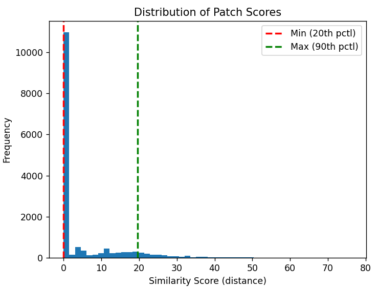

# Siamese-Network_Keypoint-Detection
This repository contains my research and innovation work which I did during my last year of IT engineering studies.

The Software used Python and Pytorch, to detect corners in pictures. You can generate a dataset, train the model on it, and detect corners on the picture you want.

Here is also a search paper I wrote to explain my approach, as well as the architecture of my program.

### Author : EL IDRISSI Mehdi

## How to use the program ?

This program was made in Python, using the PyTorch library. You need to provide the
network two libraries, "**dataset/generated/clean**" and "**dataset/generated/noisy**", that are
generated randomly : each image in the clean folder is named "**image-gen-(n°image).png**"
and has its noisy equivalent inside the noisy folder, with its name similar but quite different,
"**image-gen-n-(n°image).png**".

If you want to use your own dataset, just clear everything in the "*clean*" folder and put
yours, respecting the exact name provided, but either you give the equivalent noisy in the
noise or you clear all the files in the "*noisy*" folder : the program is able to pass through
non available noise files.

Once executed - "**python siamese_corner-detection.py**", you have 4 options that are offered to you in the main menu :

If you don’t have a model file, "siamese model-harris-orb-fast.pth", the program will
create one for you. But if you already have one in the root folder, the program will load
it :

From here, you have 4 choices :

0. Generate a brand new dataset
1. Training the model on the dataset
2. Test the model on the picture of your choice
3. Exiting the program

## Generating a dataset for the training

If you choose to execute the first one, you will have to enter how many images to
generate in the dataset :

Everything will be stored in the "**dataset/generated**" folder. If this path does not
exist, the program will create it. Once done, the same number of pictures will be created
both in the "**clean**" and "**noisy**" folders. Because every clean image created has its noisy
equivalent created in the other folder :

Example of a clean picture (left) and its noisy equivalent (right)

## Training the model

Once done, you can use this dataset to train the model :

The training will be done over the number of pictures you want to analyze - the
more is the better. Just enter the number you want, but be careful to not exceeding the
maximum (Max =...) of picture available in the dataset ! You will be then invited to
enter the number of epochs you want to train with :

For each picture trained with, you can see in real time how many corners are detected
by the following algorithms : *Harris*, *ORB* and *FAST*.

## Testing the program on a picture

You can now execute the model on a picture. Just tap "2" and enter the name of the
picture you want to work with - the picture must be in the same folder root. Some datas to train with are already given with the program.

The percentage of process is given in real time :

After processing on each patch, you can see the distribution of similarity score between
every one of them :

This score allows us to see the minimum and maximum threshold between which a
point is classified as a valid corner. This repartition of similarity depends of the training
quality of the model as well as the picture itself : it is better to adjust it by taking a
range between **20%** (min) and **90%** (max) of the global distribution :

You can now view the result of the Siamese model, as well as the result given by each
algorithm on the same picture, and compare them. In the Siamese window, each point
is colored red, and the clusters (group of points) are colored blue. There is also the total
number of points detected by the Siamese model and the number of cluster induced :

## Exiting the program

To end the program, just enter the last option :

